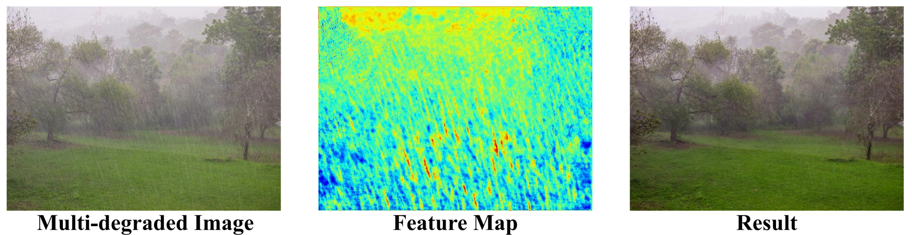

## Selective Hourglass Mapping for Universal Image Restoration Based on Diffusion Model <br><sub>Official PyTorch Implementation of DiffUIR. </sub>

[Project Page](https://isee-laboratory.github.io/DiffUIR/) | [Paper](https://arxiv.org/abs/2403.11157) | [Personal HomePage](https://zhengdian1.github.io)

### Updates
[**2024.09.17**] Given more instruction for test.py and visual.py for better usage. <br>
[**2024.03.18**] The **14 datasets link** is released. <br>
[**2024.03.17**] The **whole training and testing codes** are released!!! <br>
[**2024.03.16**] The **4 versions of pretrained weights** of DiffUIR are released. <br>
[**2024.02.27**]  🎉🎉🎉 Our DiffUIR paper was accepted by CVPR 2024 🎉🎉🎉 <br>

## Introduction

The main challenge of universal image restoration tasks is handling different degradation images at once. In this work, we propose a selective hourglass mapping strategy based on conditional diffusion model to learn the shared information between different tasks. Specifically, we integrate a 
shared distribution term to the diffusion algorithm elegantly and naturally, achieving to map the different distributions to a shared one and could further guide the shared distribution to the task-specific clean image. By only modify
the mapping strategy, we outperform large-scale universal methods with at least five times less computational costing.


### Framework comparison


# How to use

## Environment
* Python 3.79
* Pytorch 1.12

## Install

### Create a virtual environment and activate it.

```
conda create -n diffuir python=3.7
conda activate diffuir
```
### Dependencies

```
conda install pytorch torchvision torchaudio cudatoolkit=11.3 -c pytorch -c nvidia
pip install opencv-python
pip install scikit-image
pip install tensorboard
pip install matplotlib 
pip install tqdm
```

## Dataset Preparation

Preparing the train and test datasets following our paper Dataset Construction section as:

```bash
Datasets/Restoration
|--syn_rain
|  |--train
      |--input
      |--target
|  |--test
|--Snow100K
|--Deblur
|--LOL
|--RESIDE
   |--OTS_ALPHA
      |--haze
      |--clear
   |--SOTS/outdoor
|--real_rain
|--real_dark
|--UDC_val_test

```
Then get into the `data/universal_dataset.py` file and modify the dataset paths. 

### Dataset Links
#### train
| Degradation |      blurry   |   low-light   |   rainy  |   snowy  |    hazy   |
|-------------|:-------------:|:-------------:|:--------:|:--------:|:---------:|
| Datasets    | [Gopro](https://drive.google.com/file/d/1zgALzrLCC_tcXKu_iHQTHukKUVT1aodI/view?usp=sharing) | [LOL](https://drive.google.com/file/d/157bjO1_cFuSd0HWDUuAmcHRJDVyWpOxB/view) | [syn_rain](https://drive.google.com/file/d/14BidJeG4nSNuFNFDf99K-7eErCq4i47t/view?usp=sharing) |[Snow100K](https://www.google.com/url?q=https%3A%2F%2Fdesnownet.s3.amazonaws.com%2Fdataset_synthetic%2Ftrain%2FSnow100K-training.tar.gz&sa=D&sntz=1&usg=AOvVaw1Zj_7kQaF0c26DaZcoKEOr) | [RESIDE](https://pan.baidu.com/s/1c2rW4hi#list/path=%2F)(5vss)|

 #### test
| Degradation |      blurry   |   low-light   |   rainy  |   snowy  |    hazy   |
|-------------|:-------------:|:-------------:|:--------:|:--------:|:---------:|
| Datasets    | [gopro](https://drive.google.com/file/d/1k6DTSHu4saUgrGTYkkZXTptILyG9RRll/view?usp=sharing)+[HIDE](https://drive.google.com/file/d/1XRomKYJF1H92g1EuD06pCQe4o6HlwB7A/view?usp=sharing)+[real_R](https://drive.google.com/file/d/1glgeWXCy7Y0qWDc0MXBTUlZYJf8984hS/view?usp=sharing)+[real_J](https://drive.google.com/file/d/1Rb1DhhXmX7IXfilQ-zL9aGjQfAAvQTrW/view?usp=sharing) |[LOL](https://drive.google.com/file/d/157bjO1_cFuSd0HWDUuAmcHRJDVyWpOxB/view) | [combine](https://drive.google.com/file/d/1P_-RAvltEoEhfT-9GrWRdpEi6NSswTs8/view?usp=sharing)|[Snow100K](https://www.google.com/url?q=https%3A%2F%2Fdesnownet.s3.amazonaws.com%2Fdataset_synthetic%2Ftest%2FSnow100K-testset.tar.gz&sa=D&sntz=1&usg=AOvVaw3562USQHWQDnt8sLhWvl06) | [SOTS](https://utexas.app.box.com/s/uqvnbfo68kns1210z5k5j17cvazavcd1) |

 #### real
| Degradation |      real_dark   |   real_rain   |   UDC  |   real_snow  |    
|-------------|:----------------:|:-------------:|:------:|:------------:|
| Datasets    | [dark](https://drive.google.com/drive/folders/17ZjlY0ut7ye6hmQLwnplxpgDg5RQnhsf?usp=drive_link) | [rain](https://drive.google.com/drive/folders/18Tuc_EzT3aIyRoJcnNcqSp25YIpla2Ew?usp=drive_link) | [UDC](https://drive.google.com/drive/folders/1VEMP9aVcVGcaw47iKXgf-PF9tHu3vvOq?usp=drive_link) |[Snow100K](https://www.google.com/url?q=https%3A%2F%2Fdesnownet.s3.amazonaws.com%2Frealistic_image%2Frealistic.tar.gz&sa=D&sntz=1&usg=AOvVaw3SrhOt805ebXPoHQ6ruFqi) |

## Train 
We train the five image restoration tasks at once, you can change train.py-Line42 to change the task type. <br> 
Note that the result of our paper can be reimplemented on RTX 4090, using 3090 or other gpus may cause performance drop.
```
python train.py
```

## Test and Calculate the Metric
Note that the dataset of SOTS can not calculate the metric online as the number of input and gt images is different. 
Please use eval/SOTS.m.  <br>
The pretrained weight of model-300.pt is used to test with timestep 3, **check double times whether you loaded, the ``result_folder'' !!!**. <br>
Notably, change the 'task' id in test.py Line 43 to your task, low-light enhancement for 'light_only', deblur for 'blur', dehaze for 'fog', derain for 'rain', desnow for 'snow' 
```
python test.py
```

For Under-Camera real-world dataset, as the resolution is high, we split the image into several pathes and merge them after model. <br>
The pretrained weight of model-130.pt is used to test with timestep 4.
```
python test_udc.py
```

## Visualize
Here you can test our model in your personal image. Note that if you want to test low-light image, please use the code src/visualization-Line1286-1288
```
python visual.py
```
## Model Zoo
| Model |    DiffUIR-T (0.89M)  |   DiffUIR-S (3.27M)  |   DiffUIR-B (12.41M)  |   DiffUIR-L (36.26M)  |
|-------|:---------------------:|:--------------------:|:---------------------:|:---------------------:|
| Arch  |        32-1111 [Tiny](https://drive.google.com/drive/folders/163LnmMHC8wAaKRHClUp0T7oU6GcAzScO?usp=drive_link)        |        32-1224  [Small](https://drive.google.com/drive/folders/1yPPtydoUd_szWG-O65kQ5dsLpqx7BHbp?usp=drive_link)     |        64-1224     [Base](https://drive.google.com/drive/folders/1H96UB15t8pv6Rs83MBDjB7t2OrHEMt08?usp=drive_link)   |        64-1248     [Large](https://drive.google.com/drive/folders/1Wg9-5hwzZVQ_kXMomRoFSC-ZU4X6FwSH?usp=drive_link)   |

If you want to run the light version of our DiffUIR, please change the U-net architecture in train.py-Line66, the detailed arch parameters are shown above.

## Qualitative results on five restoration tasks


## Qualitative results on real-world images


## Analysis of the shared information

The distribution before and after our SDT, SDT map the different distributions to a shared one.


The attention of the feature map, our method could focus on the degradation type (rain and fog), validating that we learn the useful shared information.


# Citation

If you find this project helpful in your research, welcome to cite the paper.

```
@inproceedings{zheng2024selective,
  title={Selective Hourglass Mapping for Universal Image Restoration Based on Diffusion Model},
  author={Zheng, Dian and Wu, Xiao-Ming and Yang, Shuzhou and Zhang, Jian and Hu, Jian-Fang and Zheng, Wei-shi},
  booktitle={Proceedings of the IEEE/CVF Conference on Computer Vision and Pattern Recognition},
  year={2024}
}

```

# Acknowledgements

Thanks to Jiawei Liu for opening source of his excellent works RDDM. Our work is inspired by these works and part of codes are migrated from [RDDM](https://github.com/nachifur/RDDM).

# Contact

Please contact Dian Zheng if there is any question (1423606603@qq.com or zhengd35@mail2.sysu.edu.cn).
