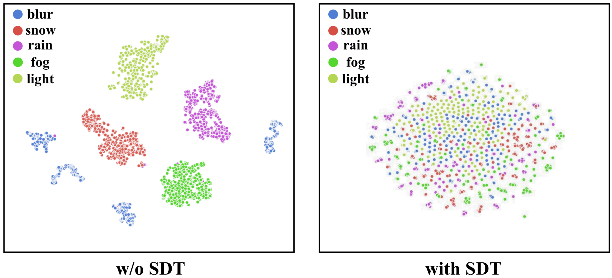

# DiffUIR (Accepted to CVPR2024)
This is the implementation of the paper: [Selective Hourglass Mapping for Universal Image Restoration Based on Diffusion Model](), Dian Zheng, Xiao-Ming Wu, Shuzhou Yang, Jian Zhang, Jian-Fang Hu, Wei-Shi Zheng

## Introduction

The main challenge of universal image restoration tasks is handling different degradation images at once. In this work, we propose a selective hourglass mapping strategy based on conditional diffusion model to learn the shared information between different tasks.


### Framework comparison


# How to use

## Environment
* Python 3.79
* Pytorch 1.12

## Install

### Create a virtual environment and activate it.

```
conda create -n diffuir python=3.7
conda activate diffuir
```
### Dependencies

```
conda install pytorch torchvision torchaudio cudatoolkit=11.3 -c pytorch -c nvidia
pip install opencv-python
pip install scikit-image
pip install tensorboard
pip install matplotlib 
pip install tqdm
```

## Data Preparation
Download [Scene Flow Datasets](https://lmb.informatik.uni-freiburg.de/resources/datasets/SceneFlowDatasets.en.html)

## Train
We train the five image restoration tasks at once, you can change the code in train.py-Line42 to change the task type.
```
python train.py
```

## Test and Calculate the Metric
Note that the dataset of SOTS can not calculate the metric online as the number of input and gt images is different. 
Please save the image and use eval/SOTS.m, the save code is in src/model.py-Line1383
```
python test.py
```

For Under-Camera real-world dataset, as the resolution is high, we split the image into several pathes and merge them after model.
```
python test_udc.py
```

## Visualize
Here you can test our model in your personal image. Note that if you want to test low-light image, please use the code src/visualization-Line1279-1281
```
python visual.py
```

### Pretrained Model

[5_tasks](https://drive.google.com/drive/folders/1aCmW6-MBBkvJ4pQ3_AchxzzrezHmArEp?usp=drive_link)
[zero-shot](https://drive.google.com/drive/folders/1aCmW6-MBBkvJ4pQ3_AchxzzrezHmArEp?usp=drive_link)

## Qualitative results on four restoration tasks (desnowing, low-light, deraining, and debluring)


## Analysis of the shared information

### The distribution before and after our SDT, SDT map the different degradation images to a shared distribution.


### The attention of the feature map, our method could focus on the degradation type (rain and fog), validating that we learn the useful shared information.


# Citation

If you find this project helpful in your research, welcome to cite the paper.

```
@inproceedings{zheng2024selective,
  title={Selective Hourglass Mapping for Universal Image Restoration Based on Diffusion Model},
  author={Zheng, Dian and Wu, Xiao-Ming and Yang, Shuzhou and Zhang, Jian and Hu, Jian-Fang and Zheng, Wei-shi},
  booktitle={Proceedings of the IEEE/CVF Conference on Computer Vision and Pattern Recognition},
  year={2024}
}

```

# Acknowledgements

Thanks to Jiawei Liu for opening source of his excellent works RDDM. Our work is inspired by these works and part of codes are migrated from [RDDM](https://github.com/nachifur/RDDM).
